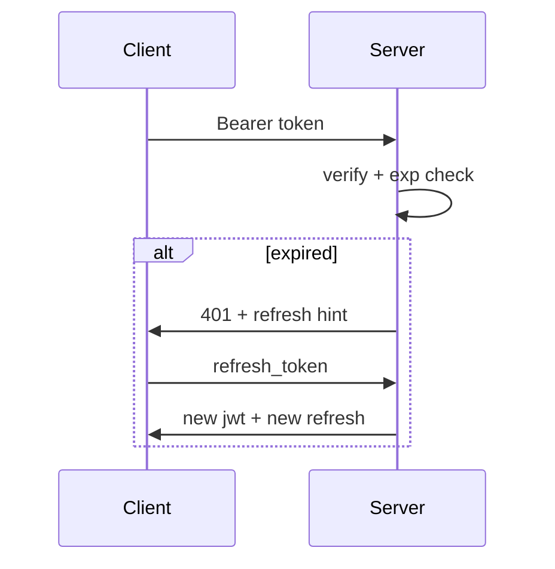

# JWT Handling

> [!NOTE] Token rotation
> Refresh tokens rotate on every use. Keep the old token for 10s to handle race conditions. See [[OAuth Flow|OAuth flow]] for the full sequence.

Validates `Authorization: Bearer <token>` and checks `exp` against clock skew ±5s. On expiry, triggers [[OAuth Flow]] silently. Part of [[Auth]] system.

- depends_on [[OAuth Flow]]
- blocks [[API Middleware]]

## Validation

```js
const payload = verify(token, SECRET);
if (payload.exp < now) throw "expired";
if (!payload.sub) throw "missing subject";
```

## Rotation

Refresh flow stores `jti` in Redis with TTL. Old token remains valid for 10s window.

> [!WARNING] Clock skew
> Never trust client clock. Use server `Date.now()` only.




Related: #jwt #auth
