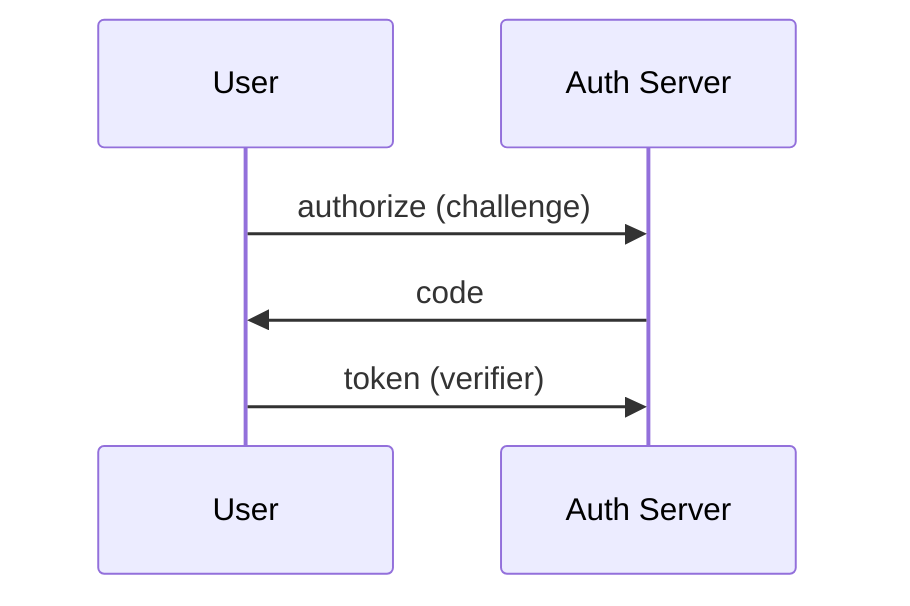

# OAuth Flow

Implements PKCE OAuth 2.1 for browser + CLI.

Steps:
1. Generate `code_verifier` and `code_challenge`
2. Redirect to authorize
3. Exchange code for tokens
4. Store via [[JWT Handling]]

- depends_on [[JWT Handling]]

#auth
